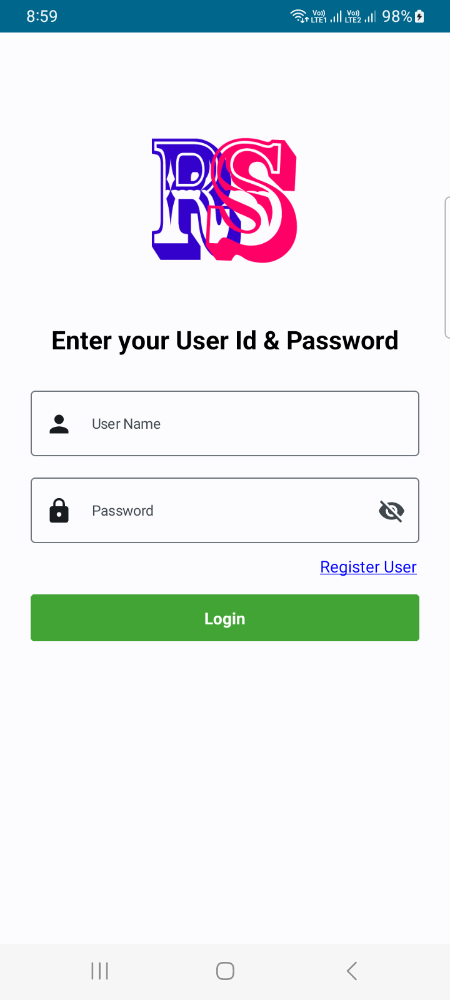
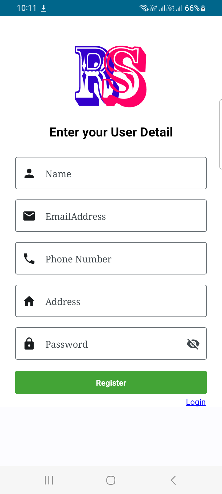
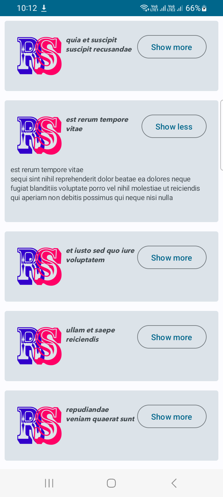

# AndroidComposeExample 

A Simple app in jetpack compose , where we can implement Login , Registration and Api Handling through Test Api

### Tech Stack

`Jetpack Compose`
`Retrofit`
`Room Database`
`DataStore`
`Dagger Hilt`
`Coroutines and Flow`
`Navigation Architecture`
`CICD Pipeline using CircleCI`

https://user-images.githubusercontent.com/62925522/233126355-9679d831-0ab3-4c47-a6fb-8985ca0ce8ba.mp4

