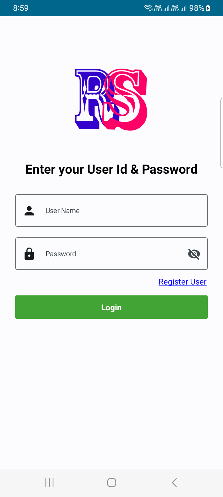
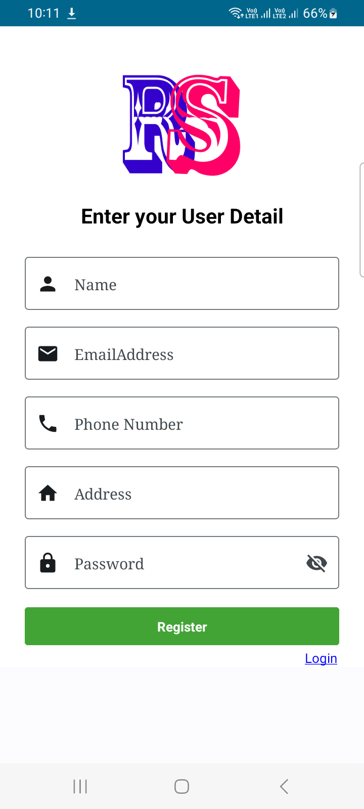
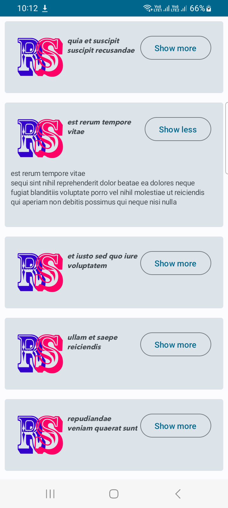

# AndroidComposeExample 
Jetpack Compose Demo Application

This demo application showcases the fundamentals of modern Android development using Jetpack Compose. It features a clean implementation of core functionalities such as:

User Authentication: Includes fully functional Login and Registration screens using Compose UI. User credentials and profile information are securely saved using Room Database.

Network Data Handling: Integrates Retrofit with a test REST API to fetch and display dynamic content. Implements proper API response handling with coroutines and ViewModel.

Local Persistence: Utilizes Room to persist user data locally and demonstrate offline support.

Smooth Navigation: Built with Jetpack Navigation Compose to provide seamless transitions between screens with state management and backstack support.

This project is a solid example of a Compose-first architecture combining MVVM, Room, and Retrofit, serving as a great starting point for real-world Android applications.

### Tech Stack

`Jetpack Compose`
`Retrofit`
`Room Database`
`DataStore`
`Hilt`
`Coroutines and Flow`
`Navigation Architecture`
`CICD Pipeline using CircleCI`

https://user-images.githubusercontent.com/62925522/233126355-9679d831-0ab3-4c47-a6fb-8985ca0ce8ba.mp4

